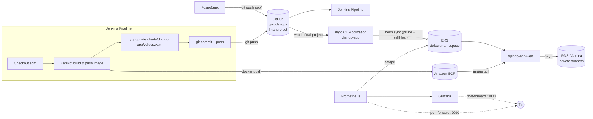

# goit-devops — Фінальний проєкт: DevOps-інфраструктура на AWS

Повна DevOps-інфраструктура на AWS, зібрана Terraform-модулями: Kubernetes
(EKS) з CI/CD через Jenkins + Argo CD, база даних через універсальний модуль
`rds` (звичайна RDS або Aurora — перемикається прапорцем), контейнерний
реєстр ECR і моніторинг кластера через Prometheus + Grafana
(`kube-prometheus-stack`).

Це підсумок усіх попередніх домашніх завдань дисципліни (`lesson-5`,
`lesson-7`, `lesson-8-9`, `lesson-db-module`), зібраних в один
Terraform-запуск: `terraform apply` піднімає все — від VPC до моніторингу —
за один прохід.

## Схема інфраструктури



## Структура проєкту

```text
.
├── main.tf                    # Провайдери (aws/kubernetes/helm) + підключення модулів
├── backend.tf                 # S3 + DynamoDB бекенд стейту
├── variables.tf / outputs.tf  # Кореневі змінні та виводи
├── Jenkinsfile                 # Pipeline: Kaniko build → ECR push → update values.yaml → git push
│
├── modules/
│   ├── s3-backend/            # S3-бакет (versioning) + DynamoDB для стейту
│   ├── vpc/                   # VPC, 3 public + 3 private subnets, IGW, NAT Gateway
│   ├── ecr/                   # ECR репозиторій + lifecycle policy
│   ├── eks/                   # EKS кластер, managed node group (2×t3.medium),
│   │                          # launch template (IMDS hop-limit=2), EBS CSI +
│   │                          # metrics-server addons, дефолтний StorageClass gp3
│   ├── rds/                   # Універсальний модуль БД: RDS або Aurora
│   │                          # (перемикається rds_use_aurora) — modules/rds/README.md
│   ├── jenkins/                # Helm-реліз Jenkins (namespace jenkins)
│   ├── argo_cd/                 # Helm-реліз Argo CD (namespace argocd) +
│   │   └── charts/              # локальний чарт з ресурсом Application (django-app)
│   └── monitoring/              # Helm-реліз kube-prometheus-stack (Prometheus + Grafana)
│
└── charts/django-app/           # Helm-чарт застосунку, який синхронізує Argo CD
    ├── templates/                # deployment, service, configmap, secret, hpa
    └── values.yaml                # image.repository/tag, env, autoscaling
```

## Передумови

- Terraform >= 1.5, AWS CLI (налаштований `aws configure` з правами
  VPC/EKS/ECR/RDS/IAM/S3/DynamoDB), `kubectl`, `helm`.
- AWS-акаунт. **Увага**: EKS control plane (~$0.10/год), NAT Gateway,
  LoadBalancer для django-app і RDS-інстанс **не повністю покриваються Free
  Tier** (Aurora — не покривається взагалі) — не забувай `terraform destroy`
  одразу після перевірки/здачі (розділ
  [Знищення інфраструктури](#знищення-інфраструктури)).
  Jenkins і Argo CD навмисно піднімаються без LoadBalancer (`ClusterIP`) —
  UI не публікується в інтернет без TLS, доступ лише через
  `kubectl port-forward`.
- Скопіюй `terraform.tfvars.example` у `terraform.tfvars` (gitignored) і
  задай `postgres_password`, `django_secret_key`. `rds_password` — опційний
  (модуль `rds` згенерує пароль сам, якщо не задати). Детально про модуль
  `rds` (звичайна БД / Aurora, як перемкнути engine тощо) — у
  [`modules/rds/README.md`](modules/rds/README.md).

## 1. Як застосувати Terraform

### Перший запуск на чистому акаунті (bootstrap стейту)

`backend.tf` вказує на S3-бакет, який створюється тим самим кодом — це
класична проблема "курка-яйце". Тому перший запуск робиться у два кроки:

```powershell
# 1. Тимчасово закоментувати backend "s3" {...} у backend.tf
terraform init
terraform apply -target=module.s3_backend -auto-approve

# 2. Розкоментувати backend "s3" {...} назад
terraform init -migrate-state -force-copy
```

### Звичайний запуск (бакет уже існує)

```powershell
terraform fmt -recursive
terraform fmt -check -recursive
terraform validate
terraform init
terraform plan
terraform apply
```

Створює VPC, EKS (2×t3.medium), ECR, RDS (або Aurora — `rds_use_aurora=true`
у `terraform.tfvars`), встановлює Jenkins, Argo CD і kube-prometheus-stack.
Створення EKS-кластера + нод-групи займає ~10-15 хв — це нормально,
Terraform чекає, поки AWS переведе ресурси у стан `ACTIVE`.

### Підключення kubectl і перевірка компонентів

```powershell
aws eks update-kubeconfig --region us-west-2 --name lesson-7-eks
kubectl get nodes
kubectl get all -n jenkins
kubectl get all -n argocd
kubectl get application django-app -n argocd
kubectl get hpa -A
```

## 2. Як перевірити Jenkins job

### Доступ до Jenkins

```powershell
kubectl port-forward -n jenkins svc/jenkins 8081:8080
# відкрити http://localhost:8081 (окремий термінал, команда тримає з'єднання)

kubectl exec -n jenkins jenkins-0 -c jenkins -- cat /run/secrets/additional/chart-admin-password
# логін: admin, пароль — вивід команди вище
```

### Налаштування (робиться один раз вручну через UI)

1. **Credentials** → додати `github-credentials` (Username with password:
   username — твій GitHub-логін, password — GitHub Personal Access Token з
   правом `repo`, потрібен для `git push` з пайплайна).
2. **New Item** → Pipeline, вказати "Pipeline script from SCM":
   - SCM: Git, репозиторій `https://github.com/SergeyPoly/goit-devops.git`,
     гілка `final-project`, credential `github-credentials`, Script Path
     `Jenkinsfile`.
3. **Build Now**.

### Перевірка результату білда

```powershell
# Job виконав усі стадії без помилок (Kaniko build/push + git push)?
# -> дивись Console Output білда в Jenkins UI

# Новий тег дійсно у ECR:
aws ecr describe-images --region us-west-2 --repository-name lesson-5-ecr `
  --query "sort_by(imageDetails,&imagePushedAt)[-1].imageTags"

# Коміт з оновленим тегом дійсно у гілці final-project:
git log --oneline -3 origin/final-project
```

## 3. Як побачити результат в Argo CD

### Доступ до Argo CD

```powershell
kubectl port-forward -n argocd svc/argo-cd-argocd-server 8080:443
# відкрити https://localhost:8080 (self-signed сертифікат — браузер попередить, це очікувано)

kubectl -n argocd get secret argocd-initial-admin-secret -o jsonpath="{.data.password}" | base64 -d
# логін: admin, пароль — вивід команди вище (якщо секрет вже видалили — див. Settings -> Accounts в UI)
```

### Перевірка синхронізації

Application `django-app` (namespace `argocd`) стежить за `charts/django-app`
у гілці `final-project` і синхронізується автоматично (`prune: true`,
`selfHeal: true`) — після пуша Jenkins-пайплайном оновлення прилетить у
кластер без ручних дій. Хост RDS/Aurora і секрети (`POSTGRES_PASSWORD`,
`DJANGO_SECRET_KEY`) Argo CD отримує не з git, а як Helm-параметри
`Application` (див. розділ [База даних](#4-база-даних-rds--aurora)).

```powershell
kubectl get application django-app -n argocd
# SYNC STATUS має бути Synced, HEALTH STATUS -> Healthy (може повисіти
# Progressing кілька секунд одразу після нового image tag)

# Образ, що реально крутиться в кластері (тег має збігатись з ECR/останнім комітом):
kubectl get deploy django-app-web -n default `
  -o jsonpath='{.spec.template.spec.containers[0].image}'

# Зовнішня адреса застосунку:
kubectl get svc django-app-service -n default
```

Якщо Argo CD ще не побачив свіжий комміт (типовий інтервал поллінгу — 3 хв),
можна форсувати рефреш:

```powershell
kubectl patch application django-app -n argocd --type merge `
  -p "{\"metadata\":{\"annotations\":{\"argocd.argoproj.io/refresh\":\"hard\"}}}"
```

## 4. База даних (RDS / Aurora)

Django більше не використовує Postgres усередині кластера — БД піднімається
модулем `rds` (`modules/rds`, детально описаний у
[`modules/rds/README.md`](modules/rds/README.md)) і хост передається у
django-app через Argo CD Application Helm-параметр `env.POSTGRES_HOST`
(див. `modules/argo_cd/charts/templates/application.yaml`), тобто реальний
endpoint ніколи не потрапляє в git.

```powershell
# Endpoint, порт, ім'я БД (не sensitive):
terraform output rds_endpoint
terraform output rds_port
terraform output rds_db_name

# Пароль (sensitive, треба -raw):
terraform output -raw rds_password
```

Щоб перемкнути на Aurora-кластер — постав у `terraform.tfvars`:

```hcl
rds_use_aurora = true
```

> ⚠️ Aurora не входить у Free Tier — тарифікується щогодини навіть на
> найменшому writer-інстансі. Для здачі/демонстрації тримай `false` (дефолт).

## 5. Моніторинг: Prometheus + Grafana

`kube-prometheus-stack` (Prometheus + Grafana + kube-state-metrics +
node-exporter; Alertmanager вимкнений — не потрібен для базового
моніторингу і економить ресурси нод) встановлений у namespace `monitoring`
без LoadBalancer — доступ лише через port-forward, щоб не плодити зайві ELB.

```powershell
# Grafana (http://localhost:3000, логін admin):
kubectl port-forward -n monitoring svc/kube-prometheus-stack-grafana 3000:80
kubectl get secret -n monitoring kube-prometheus-stack-grafana `
  -o jsonpath='{.data.admin-password}' | base64 -d

# Prometheus (http://localhost:9090):
kubectl port-forward -n monitoring svc/kube-prometheus-stack-prometheus 9090:9090
```

У Grafana одразу доступні дефолтні дашборди kube-prometheus-stack
(Kubernetes / Compute Resources, Node Exporter тощо) — Data Source
Prometheus підключається автоматично.

## Відомі обмеження

- Кредити Jenkins (`github-credentials`) і Jenkins job створюються вручну
  через UI — в Terraform/JCasC це не автоматизовано.
- Alertmanager вимкнений (`alertmanager.enabled: false`) — є лише збір
  метрик і дашборди, без сповіщень.
- RDS/Aurora розгортається без `multi_az`/reader-реплік за замовчуванням
  (`aurora_replica_count = 0`) — свідомий компроміс заради вартості.

## Знищення інфраструктури

Щоб не накопичувати рахунок за EKS/NAT/LoadBalancer-и/RDS:

```powershell
terraform destroy
```

`skip_final_snapshot = true` за замовчуванням у модулі `rds`, тому знищення
БД не блокується очікуванням фінального снапшоту.
